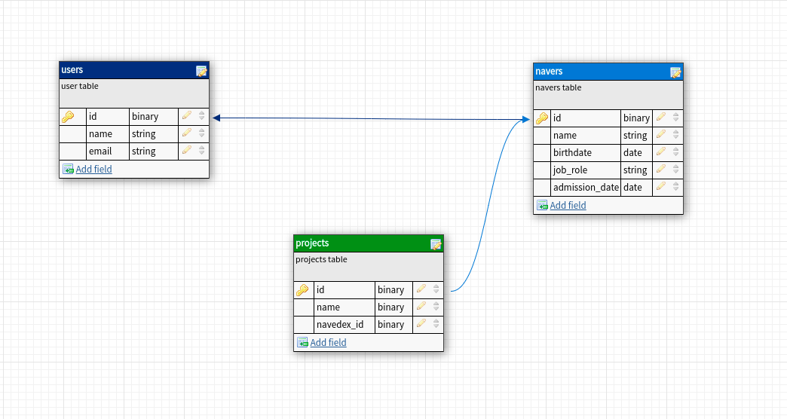

# Navedex Challenge, test for a Ruby on Rails developer job!

This project is being developed for the company Navedex, as a practical test of development using ruby on rails and the Postgresql bank, the infrastructure part of the application is using docker and docker-compose for container handling.

## Ruby version 2.7.1
## Version of Rails 6.3.1
## Database Postgresql 
I'm using **gem devise** for user authentication
I'm also using the **gem pundit** for user permissions

# Modeling the tables:

